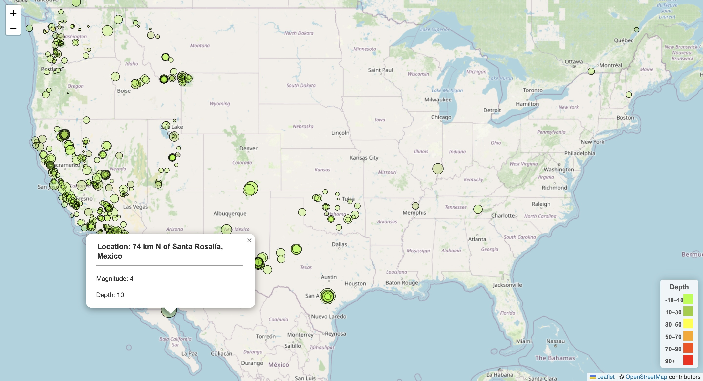

# leaflet-challenge

#### This project is about developing a way to visualize USGS earthquake data that is collected from all over the world each day, that will allow them to better educate the public and other government organizations (and hopefully secure more funding) on issues facing our planet. Tools used in this project are:
- JavaScript
- css
- HTML

#### The following tasks have been accomplished:
- Visit the USGS GeoJSON page and choose a dataset to visualize.
- Use the URL of this JSON to pull in the data for the visualization.
- Import and visualize the data by doing the following:
    - Using Leaflet, create a map that plots all the earthquakes from the dataset based on their longitude and latitude.
        - Data markers reflect the magnitude of the earthquake by their size and the depth of the earthquake by color. Earthquakes with higher magnitudes appear larger, and earthquakes with greater depth should appear darker in color.
        - The depth of the earth is the third coordinate for each earthquake.
    - Include popups that provide additional information about the earthquake when its associated marker is clicked.
    - Create a legend that will provide context for the map data.
    
